# Ciência de Dados - Projeto Final 5

## Projeto
**Modelos de clusterização e classificação** para segmentação de clientes em campanhas de marketing em uma plataforma de delivery com PySpark.

## Descrição
Nesse projeto de Ciência de Dados, resumidamente, foi realizada uma ampla análise exploratória gerando os principais insights do projeto e permitindo identificar duas principais personas para os clientes de uma plataforma de delivery. Em seguida, foi criado um modelo de clusterização usando K-Means para identificar melhor as personas dos clientes e permitindo assim a empresa direcionar melhor a campanha de marketing para os clientes que tem a maior probabilidade de aceitá-la. E por fim, foi criado um modelo de classificação usando Regressão Logística para prever se os clientes devem ou não aceitar as futuras campanhas de marketing da empresa. Em relação a parte técnica, as bibliotecas utilizadas no projeto foram: Scikit-Learn, PySpark, Pandas, Numpy, Matplotlib, Seaborn e Streamlit. Para análise e extração de insights foram utilizados gráficos e visualizações como: gráficos de contagem, gráficos de dispersão, histogramas, mapas de calor, diagramas de caixa, gráficos de barras e gráficos de rosca. Sobre o modelo de clusterização, foram usados os métodos do cotovelo e da silhueta para definir o número ideal de clusters. Já em relação aos modelos de classificação foram avaliados: classificador dummy, árvore de decisão, regressão logística, KNN, SVC, extra trees, random forest, AdaBoost e XGBoost de acordo com as seguintes métricas: acurácia, precisão, recall, área sob a curva ROC, precisão média e tempo. Sobre os cuidados em relação ao overfitting no projeto, foram aplicadas técnicas como seleção de features, balanceamento de classes, validação cruzada e otimização de hiperparâmetros para evitar que o modelo treinado apresentasse indícios de overfitting. E por último, para a realização do deploy do projeto foi estruturado a aplicação do modelo em arquivos Python, Jupyter Notebook e executáveis, além da construção de uma interface gráfica com o Streamlit. E a arquitetura usada para estruturar todo esse projeto foi a arquitetura medallion, segmentando os dados de acordo com a camada de sua finalidade: resource, bronze, silver e gold.

## Resultados - Projeto

## Resultados - EDA
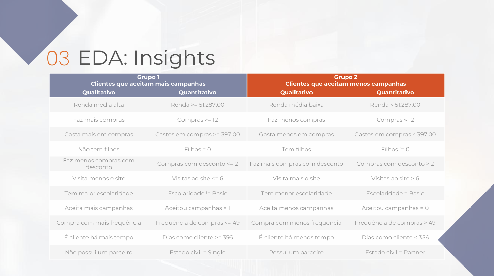

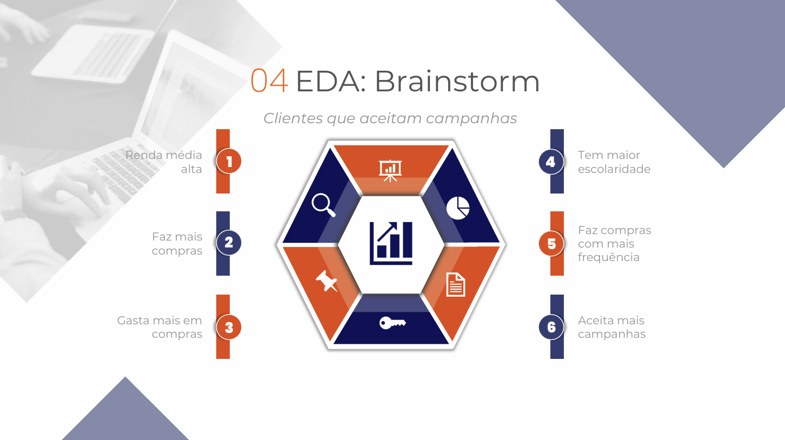

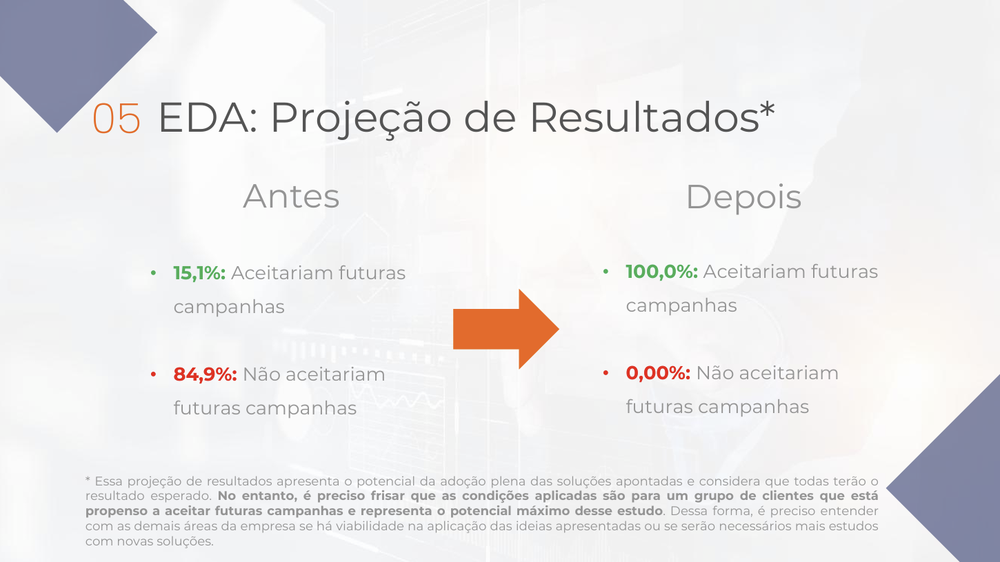

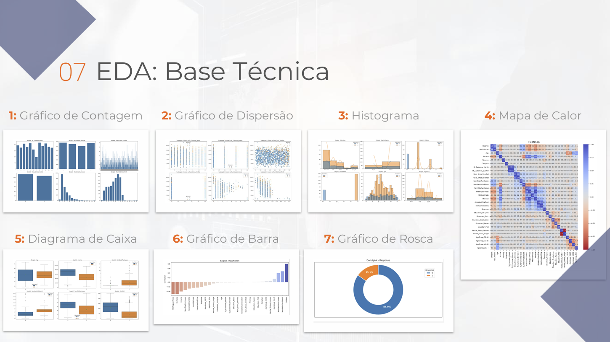

## Resultados - Clusterização
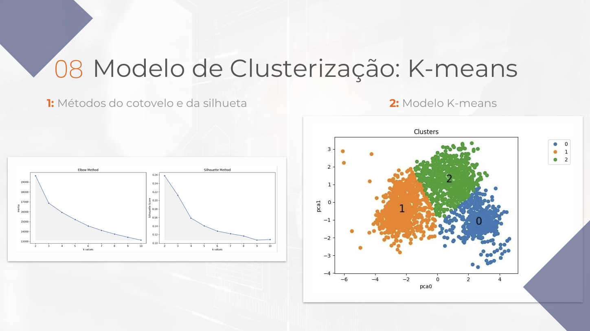

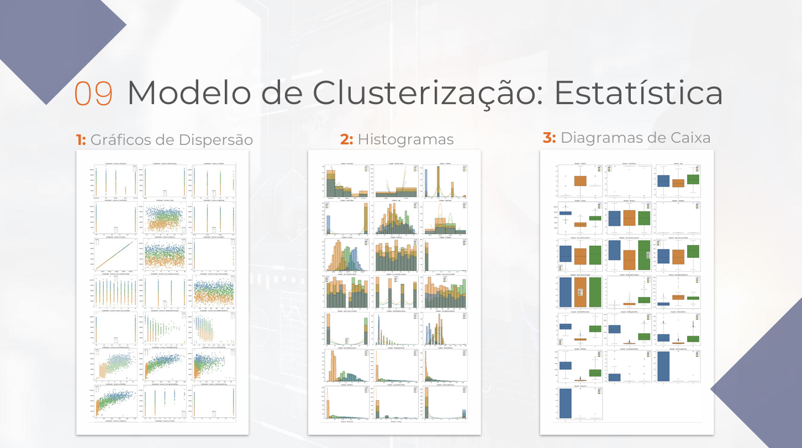

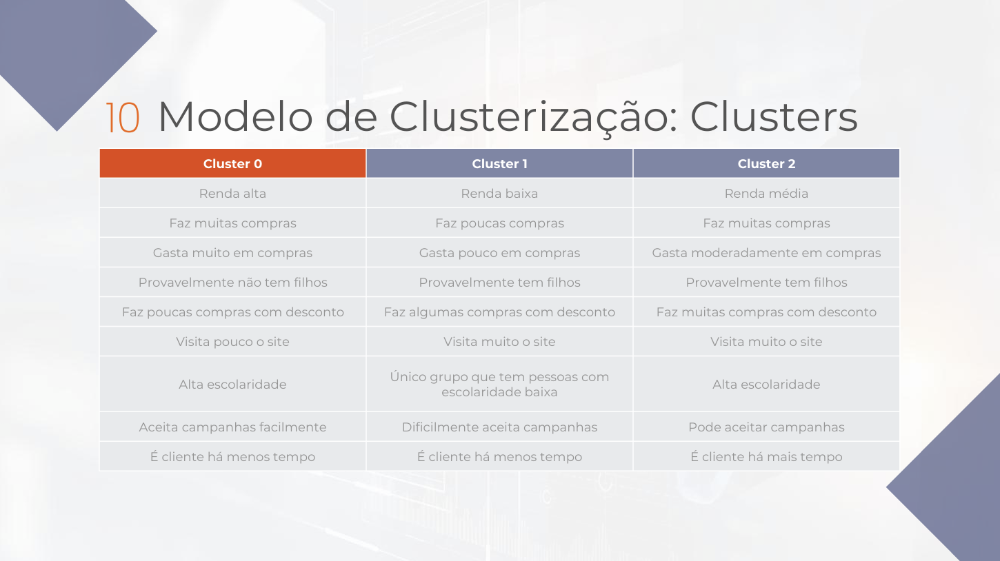

## Resultados - Classificação
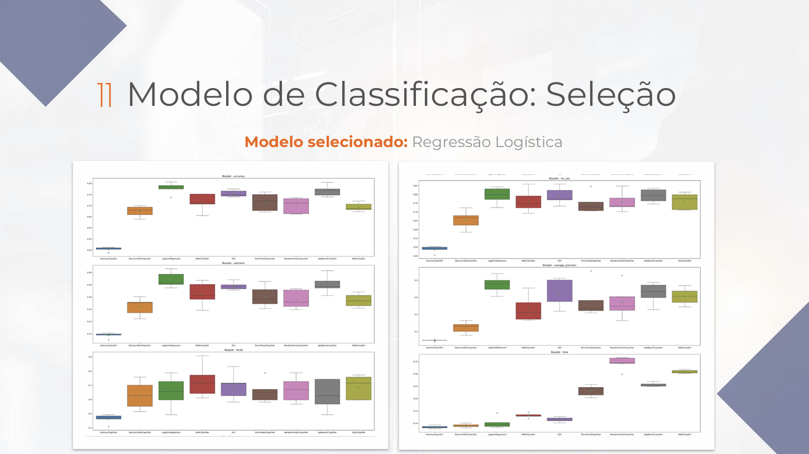

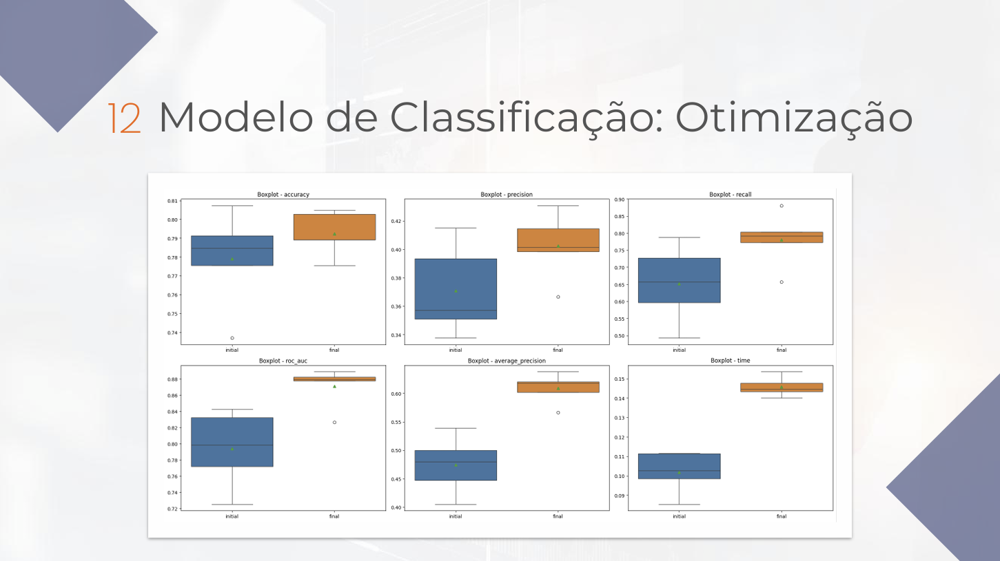

## Resultados - Overfitting
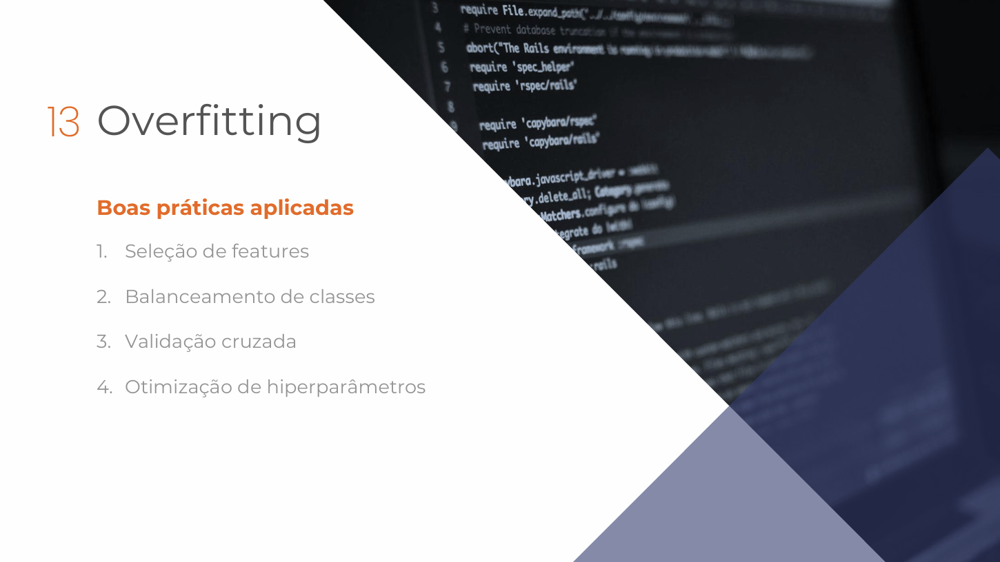

## Resultados - Deploy
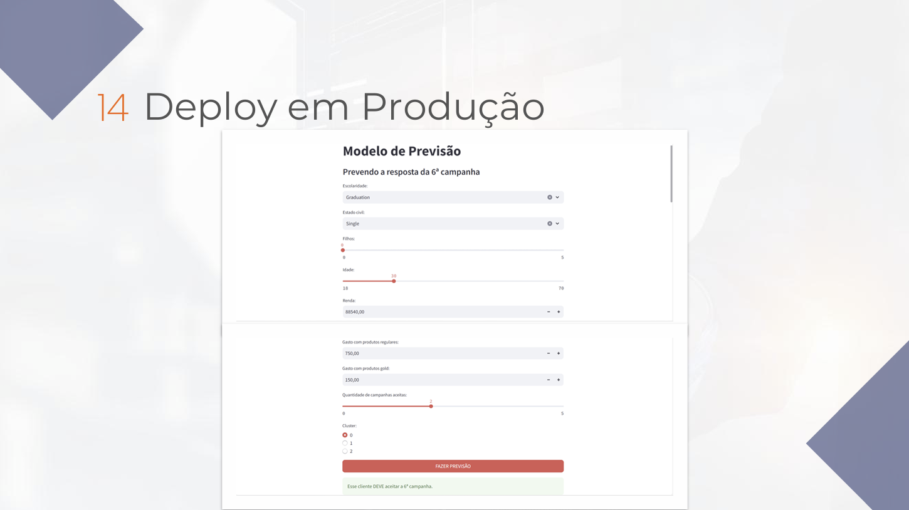

## Resultados - Conclusão
